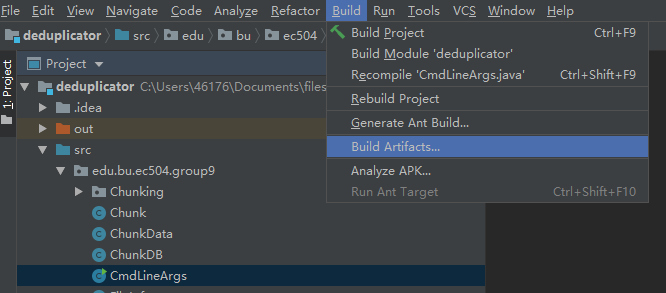

# Install Instruction
## I. Pre-conditions
Operating System: Linux, Mac OS
## II. Supporting files
### How to use dedup command?
#### For Linux:  
go to the `release` folder, there are two files: `dedup` and jar file `deduplicator.jar`.  
then use  
```
chmod +x dedup
```
make dedup executable.  

add the path of dedup into the `PATH` environment variable.  
```
export PATH=$PATH:/home/yuxuansu/study/EC504/Deduplicator/release
```

then you can use the dedup command to add file or retrieve file  
```
dedup -addFile <filename> -locker <lockername>
dedup -retrieveFile <filename> -output <file saved path> -locker <lockername>
```

start the GUI program  
```
dedup -gui
```
#### For Mac OS:
you can use the java command to add file or retrieve file  
```
java -jar deduplicator.jar -addFile <filename> -locker <lockername>
java -jar deduplicator.jar -retrieveFile <filename> -output <file saved path> -locker <lockername>
```

start the GUI program  
```
java -jar deduplicator.jar -gui
```

all the chunks and metadata will be stored into `$HOME/.dedupStore` directory.

### How to use the GUI program?
start GUI program
```
dedup -gui
```
in the main program, run the whole program, then you can use the program with GUI.  
  
On the top of the window, you can see a text filed and a button. When you press the `Add Locker` button, the program will create a new locker whose name is the text in the text field.  

Below, there is a ComboBox. With the Combo box, you can select the locker you want to choose. Then the list below will show all files in the locker.  

With the button named "add file" on the right side, you can choose a file or a directory and add it to the locker. The locker's name will be the name you selected in the ComboBox.  

The search button will search substring in the locker you selected, and you can enter the string you want to search in the second text field above that button.  

And you can see two buttons with the name "Import" and 'Export'. You can import or export the whole locker and chunks with these two buttons, which makes this program portable.  

At the bottom is a Information Area. You cannot edit it. The area will show the result after processing your command.  

## III. Execution
All codes are in the bitbucket. You can build a jar file by your own, or you can use the jar file we built in the "release" folder.  
### Instructions:
clone the repository:  
```
git clone https://agile.bu.edu/bitbucket/scm/ec504proj/group9.git
```
open IntelliJ, click File/Open..., choose the directory to open:  
   

If using IntelliJ, you may need to set src to the Source Root:  
  
then create an out directory:  


config the "Project Structure" as follow:  
  
go to "Project Structure" and click "artifacts", add new jar from modules with dependencies, choose "CmdLineArgs.Java" for main class and click ok:
  
  

build, and then build artifacts:  


Now you should have jar file under your out folder:  
  

You can copy this jar file to the `release` folder, and follow the instuctions above to start the GUI program or use command-line UI.  