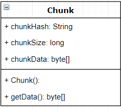

# Deduplicator

## I. Documentation
### Problem Description
System deduplicator serves to remove the same file. There are essentially two ways of deduplication: file deduplication and block deduplication. File deduplication is relatively easy to implement. We can just remove files by typing commands in terminal. However, block deduplication is hard that we need to chunk each file into blocks. That is what we mainly focus on this project.  
Our goal is to design and implement an efficient data storage locker that utilizes deduplication. Our locker is able to accept files and store them (for later retrieval) with a minimum storage by storing some common data blocks only once. For example, a first file containing "This is an example" might store all characters, but a second file containing "This is an example too" might store a pointer to the first file followed by " too".  
### Group Members
* Yuxuan Su (syx525@bu.edu)
* Kainan Liu (liuknan@bu.edu)
* Zhangyu Wan (wanzy@bu.edu)
* Xiangkun Ye (xk1997@bu.edu)
* Leyang Shen (leonshen@bu.edu)
### System Design and Data Structures
There's an overview of the whole deduplicator system:  
  
**All the chunks and metadata will be stored into `$HOME/.dedupStore` directory.**
#### FileInfo and Chunk class:
In order to save one file's metadata, we define a class called FileInfo:  
  
we used a LinkedList to store all the hashes of this file's chunks.  
In order to save each chunk data, we defined a class called Chunk:  


#### Locker:  
Each locker represents a single storage space. Locker is the major module that users interact with. All the files and directories informations are saved in the lockers. Users use the functions defined in Locker class to add file, retrieve file or delete file.  
Design and data structures of Locker class:  
  
We defined a class called LockerMeta to store all the Locker's files informations. In LockerMeta, there are two hashmap, one stores all the FileInfo object(using filename as key); another stores the directories relationship:  


#### ChunkDB:
ChunkDB is a singleton class. It's used to record all the chunks' metadata and the location of each chunk's data.  


#### Chunking Module:
Chunking Module is mainly used to implement chunking algorithm. It will split the files into chunks and compute the hash of each chunk. Currently we implemented a FixedSizeChunking and a RollingHashChunking.  

### Features Implemented
#### Minimum Requirements
1. Ability to store fifty 10MB ASCII files, using at most 100MB of storage.  
  To deduplicate those ASCII files, we simply use a fixed size chunking algorithm, which deviding file into 8KB chunks and use their hashcode to determine if we have stored the same chunk before, if so, we can prevent store the redundant data.
2. Ability to retrieve all files stored in the locker.  
  To retrieve files, we'd traverse all chunks consist of target file(Stored in a Fileinfo class instance as a LinkedList) and use FileOutputStream to make a new file.
3. Locker should be portable.  
  Locker's data can be easily imported or exported by clicking the 'import' and 'export' button in our program. All the locker's metadata and all the related chunks will be exported or imported. 
4. Command-line UI.  

Commands: dedup -addFile <file name> -locker <locker name> and dedup -retieveFile <file name> -output <where the retrieved file should be saved> -locker <locker name>. are available. The gui command is also available if user want to launch GUI. See Install.MD for details.

**All the chunks and metadata will be stored into `$HOME/.dedupStore` directory.**

#### Advanced Features
1. Ability to efficiently store similar images.  
  For images and videos, we implemente the Rabin–Karp algorithm(content-defined chunking) with rolling hash. We set the average chunk size into 8 KB and a window size of 64 Bytes. Then this window would traverse the whole file and use rolling hash
   to efficiently calculate the hashvalue for every part and make a new chunk when the last 13 bits equal to 0. So the chunk size would automatically adjust according to the content in files and significantly improve the deduplication rate.
2. Ability to efficiently store similar videos.
3. Develop networked access to your locker.  
  Failed. Was thinking and trying to use Tomcat to build the servlet that can execute the command lines:  dedup -addFile <file name> -locker <locker name> and dedup -retieveFile <file name> -output <where the retrieved file should be saved> -locker <locker name>. But the learning process is way beyond expectation and none of us has java web experience before. For retrieving file method on server, it is also hard to accomplish because the server needs to identify and collect user local chunk and locker information. The target file will be uploaded to the server first and then the user can retrieve the origin file and download from the web again. 

4. Develop a GUI.   
  Basically, it connects all different file modules together. GUI visualizes all available functions to the user. User can customize locker, add file, retrieve file, delete file and do substring search. 

5. Ability to store directories of files as one entity.  
  This function is mainly for users with directories of files instead of single file. Before storing the file/directory, we will check wether the storing target is a file or directory. If the target is directory, we will store the path of directory and its child directory and all the files it contains in a hashMap. Instead of storing the directory directly, we only store the files and save the path of the files to guarantee to retrieve them with the same directory stucture.
  In order to do this, when retrieving file/directory, we iterate value corresponding to the path in the hashMap, and then retrieve the file directly and create that directroy when it is a directory.

6. Implement file deletion from your locker.  
  If the filename is not a directory, remove the target file directly and remove chunk through hashes. If it is a directory, delete the file in the locker list and remove the file as before. If this file belongs to one directory, remove this file from the directory.

7. Implement efficient substring search.  
  For substring search, we implement the KMP algorithm to search efficiently inside every locker. For each locker, we will retrieve every file inside to make sure that we could go through every character.  
    At last it will return a list with files, which include the string we want to search.

### References & materials
| Citation | Annotation |
| ------------- | ------------- |
| 1 Venish, A., and K. Siva Sankar. "[[https://www.semanticscholar.org/paper/Study-of-Chunking-Algorithm-in-Data-Deduplication-Venish-Sankar/9862f944d36806c69e50875c0e6c055e80894e80][Study of chunking algorithm in data deduplication.]]" _Proceedings of the International Conference on Soft Computing Systems_. Springer, New Delhi, 2016.  | This paper mainly gives us an overall introduction of popular chunking algorithms which can be used in deduplication problem as well as the comparison of their performances. Although the paper doesn't dive deep in any chunking algorithms, it helps us to have a basic direction which is more like a high-level guidance. According to this paper, we decide to use fix size chunking and Rabin fingerprint chunking algorithm with chunk size of 8kB.|
| 2 El-Shimi, Ahmed, et al. "[[https://www.usenix.org/conference/atc12/technical-sessions/presentation/el-shimi][Primary data deduplication—large scale study and system design.]]"Presented as part of the 2012 {USENIX} Annual Technical Conference ({USENIX}{ATC} 12). 2012. | This paper mainly focused on maximizes deduplication savings while minimizing the generated metadata. This can be achieved by producing a uniform chunk size distribution. They found duplication within primary datasets to be far from homogenous, existing in about half of the chunk space and naturally partitioned within that subspace. So that as long as running a similar algorithm on a big chunk like 64 kB, we can achieve a better deduplication saving than traditional 4-8kB. Also, they demonstrated how deduplication of primary file- based server data can be significantly optimized for both high deduplication savings and minimal resource consumption through the use of a new chunking algorithm, chunk compression, partitioning, and a low RAM foot- print chunk index. |
| 3 Kim D., Song S., Choi BY. (2017) [[https://link.springer.com/chapter/10.1007/978-3-319-42280-0_2][Existing Deduplication Techniques]]. In: Data Deduplication for Data Optimization for Storage and Network Systems. Springer, Cham. 2017. | This paper explains how to efficiently detect redundacy using chunk index cahes and bloom filters. The paper describes how each deduplication technique works along with existing approaches and elaborate on commercially and academically existing deduplication solutions. |
| 4 Fanglu Guo and Petros Efstathopoulos. 2011.[[https://dl.acm.org/citation.cfm?id=2002206][ Building a high-performance deduplication system]]. In Proceedings of the 2011 USENIX conference on USENIX annual technical conference (USENIXATC'11). USENIX Association, Berkeley, CA, USA, 25-25. | This paper talks about many aspect of building a deduplication system. We learn from the system design in this paper and implement our own software architecture. |
| 5 Moon, Young Chan, et al. "[[https://dl.acm.org/citation.cfm?id=1997176][Data deduplication using dynamic chunking algorithm]]." _International Conference on Computational Collective Intelligence_. Springer, Berlin, Heidelberg, 2012. | This paper gives a brief introduction of different chunking algorithm. We found out that there are two different kind of chunking: the fixed size chunking and rolling hash chunking. Also, we learned may knowledge baout the Rabin-fingerprint algorithm, TTTD algorithm, etc. |

## II. Code
1. All complete, working Java code used in our implementation.

| Code file name | Description |
| ------------- | ------------- |
| FixedSizeChunking.java | Fixed Size Chunking implementation |
| RollingChunking.java | Content-Defined Chunking implementation |
| ChunkData.java | Record chunk hash and data |
| ChunkDb.java | Chunk storage implementation |
| CmdLineArgs.java | Command line implementation |
| FileInfo.java | File information storage implementation | 
| FileIO.java | File import and export |
| GUI.java | Application GUI implementation |
| KMP.java | Substring search implementation |
| Locker.java | Add, retrieve and delete file|
| LockerFactory.java | Locker architecture implementation |
| LockerMeta.java | Store locker file info |
| Main.java | Main file |
| OpResult.java | Display error or other messages |

2. Data needed to run the project:

Test text files can be generated by TestfileCreator.py in the TestfileCreator folder. Users can download similar images via https://drive.google.com/open?id=1QqMAYOtq8gpC45sd6r42-hMgl8tHzIzt, similar videos via https://drive.google.com/open?id=1YKli1d2lcBiNhBavk5Iz1ESK2mhWpkGo. For both dataset, half of them are original images/videos and another half has been randomly added some breakpoints (like green lines in images).

* To generate test files, since there is only a function inside the TestfileCreator, you need to use python at first:
```
python
```
* Then import the module
```
import TestfileCreator
```
* At last, generate test files
```
TestfileCreator.createTestFile()
```
* You could see the test file folder in your current directory.

3. All testing code utilized to observe the correctness of your code.

Similar to the last section. We also use TestfileCreator.py to test our java code. It randomly generates text files that we can use to test our adding, retrieving and deleting files. By retrieving the text file, we are able to know the correctness of our code. And for the same purpose of images and videos(Users can download similar images via https://drive.google.com/open?id=1QqMAYOtq8gpC45sd6r42-hMgl8tHzIzt, similar videos via https://drive.google.com/open?id=1YKli1d2lcBiNhBavk5Iz1ESK2mhWpkGo. For both dataset, half of them are original images/videos and another half has been randomly added some breakpoints (like green lines in images).

## III. Work Breakdown  


## IV. Jira Links
https://agile.bu.edu/jira/projects/GROUP9/summary
